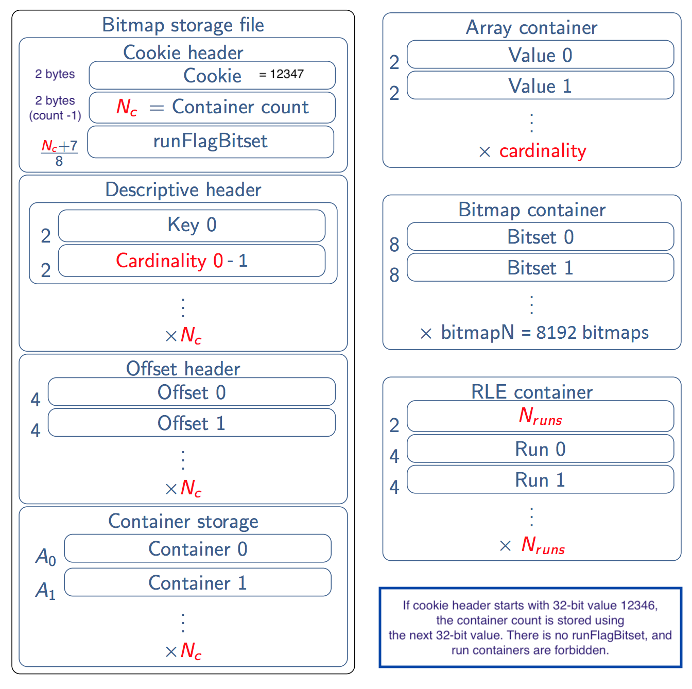

# RoaringFormatSpec : specification of the compressed-bitmap Roaring format


Roaring bitmaps are used by several important systems:

*   [Apache Lucene](http://lucene.apache.org/core/) and derivative systems such as Solr and [Elastic](https://www.elastic.co/),
*   Metamarkets' [Druid](http://druid.io/),
*   [Apache Spark](http://spark.apache.org),
*   [Apache Hive](http://hive.apache.org),
*   [Apache Tez](http://tez.apache.org),
*   [Netflix Atlas](https://github.com/Netflix/atlas),
*   [LinkedIn Pinot](https://github.com/linkedin/pinot/wiki),
*   [OpenSearchServer](http://www.opensearchserver.com),
*   [Cloud Torrent](https://github.com/jpillora/cloud-torrent),
*   [Whoosh](https://pypi.python.org/pypi/Whoosh/),
*   [Pilosa](https://www.pilosa.com/),
*   [Jive Miru](https://github.com/jivesoftware/miru),
*   [Microsoft Visual Studio Team Services (VSTS)](https://www.visualstudio.com/team-services/),
*   eBay's [Apache Kylin](http://kylin.io).

Many of these systems use the following interoperable format.

This specification assumes that you are familiar with Roaring bitmaps. Please refer to the following paper for details on the design rationale:

- Daniel Lemire, Gregory Ssi-Yan-Kai, Owen Kaser, [Consistently faster and smaller compressed bitmaps with Roaring](https://arxiv.org/abs/1603.06549), Software: Practice and Experience, Software: Practice and Experience Volume 46, Issue 11, pages 1547-1569, November 2016

Let us recap that Roaring bitmaps are designed to store sets of 32-bit (unsigned) integers. Thus a Roaring bitmap can contain up to 4294967296 integers. They are made of three types of 16-bit containers: array, bitset and run containers. There are between 1 and 65536 (inclusively) containers. Each container has a cardinality (value in [1, 65536]), and it has a 16-bit most significant value (also called "key") in [0,65536). All containers are non-empty.

There are extensions of Roaring Bitmaps for storing 64-bit integers. However, the current format specification only relates to 32-bit integers.


## General layout

All words are written using little endian encoding.

The layout is designed so that random access to the data is possible without materializing the bitmap in memory while being storage efficient.

- There is an initial "cookie header" which allows us to recognize that the bit stream is a roaring bitmap and gather some minimal information;
- The cookie header is followed by a "descriptive header" which describes the containers;
- Depending on the cookie header, there is an offset header to allow fast random access to the stored containers;
- The header is followed by the containers, serialized one by one.

Throughout, we use the following constants :

- SERIAL_COOKIE_NO_RUNCONTAINER = 12346,
- SERIAL_COOKIE = 12347,
- NO_OFFSET_THRESHOLD = 4

The below diagram represents a storage file containing both run containers and the offset header.



### 1. Cookie header

The cookie header spans either 32 bits or 64 bits.

1. If the first 32 bits take the value SERIAL_COOKIE_NO_RUNCONTAINER, then no container part of the Roaring bitmap can be of type "run" (only array and bitset containers are allowed). When the cookie has this particular value, the next 32 bits are used to store an integer representing the number of containers. If the bitmap is empty (i.e., it has no container), then you should choose this cookie header.
2. The 16 least significant bits of the 32-bit cookie have value SERIAL_COOKIE. In that case, the 16 most significant bits of the 32-bit cookie are used to store the number of containers minus 1. That is, if you shift right by 16 the cookie and add 1, you get the number of containers. Let ``size`` be the number of containers. Then we store ``(size + 7) / 8`` bytes, following the initial 32 bits, as a bitset to indicate whether each of the containers is a run container (bit set to 1) or not (bit set to 0). The first (least significant) bit of the first byte corresponds to the first stored container and so forth.

Thus it follows that the least significant 16 bits of the first 32 bits of a serialized bitmaps should either have the value SERIAL_COOKIE_NO_RUNCONTAINER or the value SERIAL_COOKIE. In other cases, we should abort the decoding.

After scanning the cookie header, we know how many containers are present in the bitmap.

### 2. Descriptive header

The cookie header is followed by a descriptive header. For each container, we store
the key (16 most significant bits) along with the cardinality minus 1, using 16  bits
for each value (for a total of 32 bits per container).

Thus, if there are x containers, the descriptive header will contain 32 x bits or 4 x bytes.

After scanning the descriptive header, we know the type of each container. Indeed,
if the cookie took value SERIAL_COOKIE, then we had a bitset telling us which containers
are run containers; otherwise, we know that there are no run containers. For the containers
that are not run containers, then we use the cardinality to determine the type: a
cardinality of up to 4096 indicates an array container whereas a cardinality above
4096 indicates a bitset container.

### 3. Offset header

If and only if one of these is true

1. the cookie takes value SERIAL_COOKIE_NO_RUNCONTAINER
2. the cookie takes the value SERIAL_COOKIE *and* there are at least NO_OFFSET_THRESHOLD containers, 

then we store  (using a 32-bit value) the location (in bytes) of the container from the beginning of the stream (starting
with the cookie) for each container.

### 4. Container storage

The containers are then stored one after the other.
- For array containers, we store a sorted list of 16-bit unsigned integer values corresponding to the array container. So if there are x values in the array container, 2 x bytes are used.
- Bitset containers are stored using exactly 8KB using a bitset serialized with 64-bit words. Thus, for example, if value j is present, then word j/64 (starting at word 0) will have its (j%64) least significant bit set to 1 (starting at bit 0).
- A run container is serialized as a 16-bit integer indicating the number of runs, followed by a pair of 16-bit values for each run. Runs are non-overlapping and sorted. Thus a run container with x runs will use 2 + 4 x bytes. Each pair of 16-bit values contains the starting index of the run followed by the length of the run minus 1. That is,  we interleave values and lengths, so that if you have the values 11,12,13,14,15, you store that as 11,4 where 4 means that beyond 11 itself, there are  4 contiguous values that follow. Other example: e.g., 1,10, 20,0, 31,2 would be a concise representation of 1, 2, ..., 11, 20, 31, 32, 33

## Testing

At a minimum, all Roaring implementations should be able to parse the two files in the ``testdata`` directory, see the associated README.md file found in the directory.

## Reference implementations

- C/C++: https://github.com/RoaringBitmap/CRoaring
- Java: https://github.com/RoaringBitmap/RoaringBitmap
- Go: https://github.com/RoaringBitmap/roaring


## Sample Java source code

```Java

    int startOffset = 0;
    boolean hasrun = hasRunContainer();
    if (hasrun) {
      out.writeInt(Integer.reverseBytes(SERIAL_COOKIE | ((size - 1) << 16)));
      byte[] bitmapOfRunContainers = new byte[(size + 7) / 8];
      for (int i = 0; i < size; ++i) {
        if (this.values[i] instanceof RunContainer) {
          bitmapOfRunContainers[i / 8] |= (1 << (i % 8));
        }
      }
      out.write(bitmapOfRunContainers);
      if (this.size < NO_OFFSET_THRESHOLD) {
        startOffset = 4 + 4 * this.size + bitmapOfRunContainers.length;
      } else {
        startOffset = 4 + 8 * this.size + bitmapOfRunContainers.length;
      }
    } else { // backwards compatibility
      out.writeInt(Integer.reverseBytes(SERIAL_COOKIE_NO_RUNCONTAINER));
      out.writeInt(Integer.reverseBytes(size));
      startOffset = 4 + 4 + 4 * this.size + 4 * this.size;
    }
    for (int k = 0; k < size; ++k) {
      out.writeShort(Short.reverseBytes(this.keys[k]));
      out.writeShort(Short.reverseBytes((short) (this.values[k].getCardinality() - 1)));
    }
    if ((!hasrun) || (this.size >= NO_OFFSET_THRESHOLD)) {
      // writing the containers offsets
      for (int k = 0; k < this.size; k++) {
        out.writeInt(Integer.reverseBytes(startOffset));
        startOffset = startOffset + this.values[k].getArraySizeInBytes();
      }
    }
    for (int k = 0; k < size; ++k) {
      values[k].writeArray(out);
    }
```
## Sample C source code
```C

    char *initbuf = buf;
    uint32_t startOffset = 0;
    bool hasrun = ra_has_run_container(ra);
    if (hasrun) {
        uint32_t cookie = SERIAL_COOKIE | ((ra->size - 1) << 16);
        memcpy(buf, &cookie, sizeof(cookie));
        buf += sizeof(cookie);
        uint32_t s = (ra->size + 7) / 8;
        uint8_t *bitmapOfRunContainers = (uint8_t *)calloc(s, 1);
        assert(bitmapOfRunContainers != NULL);  // todo: handle
        for (int32_t i = 0; i < ra->size; ++i) {
            if (get_container_type(ra->containers[i], ra->typecodes[i]) ==
                RUN_CONTAINER_TYPE_CODE) {
                bitmapOfRunContainers[i / 8] |= (1 << (i % 8));
            }
        }
        memcpy(buf, bitmapOfRunContainers, s);
        buf += s;
        free(bitmapOfRunContainers);
        if (ra->size < NO_OFFSET_THRESHOLD) {
            startOffset = 4 + 4 * ra->size + s;
        } else {
            startOffset = 4 + 8 * ra->size + s;
        }
    } else {  // backwards compatibility
        uint32_t cookie = SERIAL_COOKIE_NO_RUNCONTAINER;

        memcpy(buf, &cookie, sizeof(cookie));
        buf += sizeof(cookie);
        memcpy(buf, &ra->size, sizeof(ra->size));
        buf += sizeof(ra->size);

        startOffset = 4 + 4 + 4 * ra->size + 4 * ra->size;
    }
    for (int32_t k = 0; k < ra->size; ++k) {
        memcpy(buf, &ra->keys[k], sizeof(ra->keys[k]));
        buf += sizeof(ra->keys[k]);

        uint16_t card =
            container_get_cardinality(ra->containers[k], ra->typecodes[k]) - 1;
        memcpy(buf, &card, sizeof(card));
        buf += sizeof(card);
    }
    if ((!hasrun) || (ra->size >= NO_OFFSET_THRESHOLD)) {
        // writing the containers offsets
        for (int32_t k = 0; k < ra->size; k++) {
            memcpy(buf, &startOffset, sizeof(startOffset));
            buf += sizeof(startOffset);
            startOffset =
                startOffset +
                container_size_in_bytes(ra->containers[k], ra->typecodes[k]);
        }
    }
    for (int32_t k = 0; k < ra->size; ++k) {
        buf += container_write(ra->containers[k], ra->typecodes[k], buf);
    }
```

## Unsigned integers in Java


Java lacks native unsigned integers, but integers are still considered to be unsigned within Roaring, and ordered  according to  ``Integer.compareUnsigned``. 

For integers in [0,2147483647], the unsigned and signed integers are undistinguisable since Java relies a 32-bit two's complement format for its ``int`` type.
